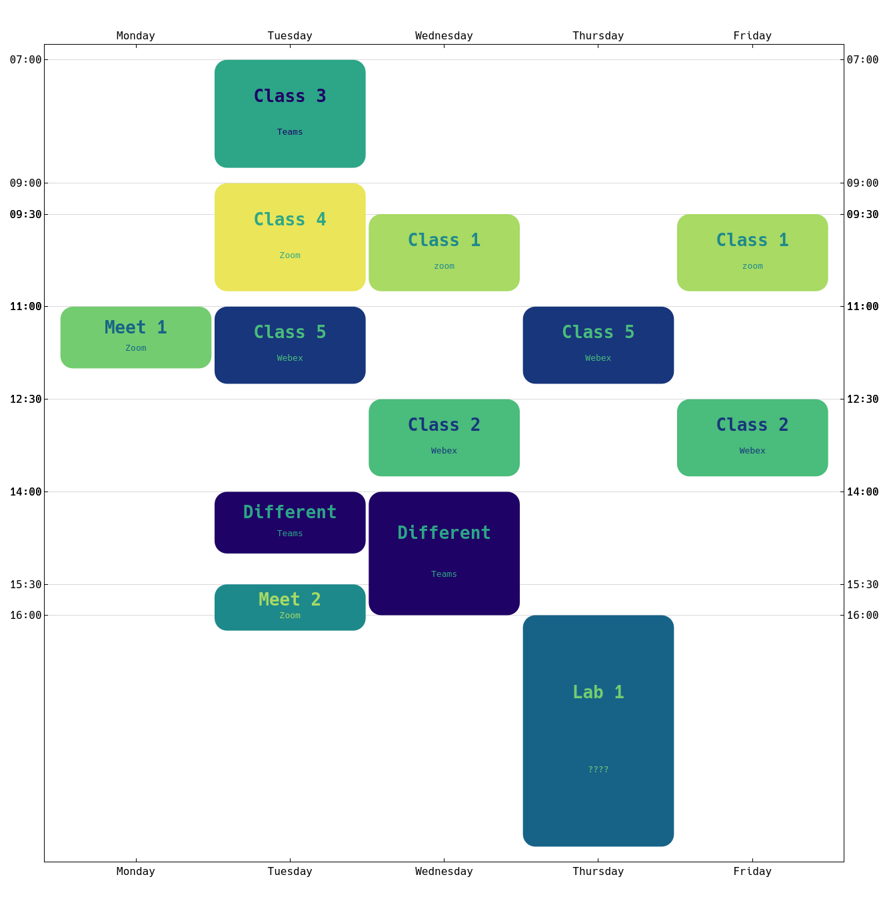

# wolfram-schedule-tab

Tool for generate a weekly schedule in the Wolfram language.

## How to use

>(First install the [Hack font](https://github.com/source-foundry/Hack) of change the font in the `Hack` function)

Create a tab separated file like the one in `./test`.

| Name          | Days   | Start | End   | Place |
|-|-|-|-|-|
| Meet 1        | L      | 11:00 | 12:00 | Zoom  |
| Different     | M      | 14:00 | 15:00 | Teams |
| Different     | I      | 14:00 | 16:00 | Teams |
| Meet 2        | M      | 15:30 | 16:15 | Zoom  |
| Class 1       | IV     | 9:30  | 10:45 | Zoom  |
| Class 2       | IV     | 12:30 | 13:45 | Webex |
| Class 3       | M      | 7:00  | 8:45  | Teams |
| Class 4       | M      | 9:00  | 10:45 | Zoom  |
| Class 5       | MJ     | 11:00 | 12:15 | webex |
| Lab 1         | J      | 16:00 | 19:45 | ????  |

Then you save the path of this file on the `shcedule` variable on Mathematica, and run the contents of `generate.wl`. That will generate a graphics that you can export however you want.

The days are the initials of the spanish names, because the names are in spanish. You can modify that easily on `xticks` and the initials' map on `DayNumbers`.

Note that you can specify your lectures on a per-meeting base, but you can also specify multiple days if the meetings have the same schedule on different days.
Items on the schedule file will be combined if they have the same name.
If the lecture happens in two places/schedules on two different days that way.

### Features

* Lectures on different days can have different times and places.
* Automatic color picking with contrast ratio > 3 at least. Color assignment is random.
* Time ticks only at the beggining of items.
* `14:25` and `2:25pm` are both valid hours. All is left to the Mathematica `Interpreter`.

### Ideas

* Weekday numbers format. This will be a pain, because nobody agrees on which is day `1`.
* Support for week parity i.e. when you have something to do one week but not the next.
* Adaptative font size?

### Example

