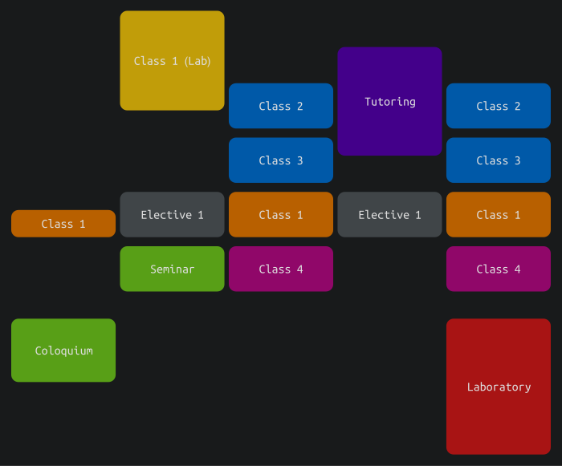
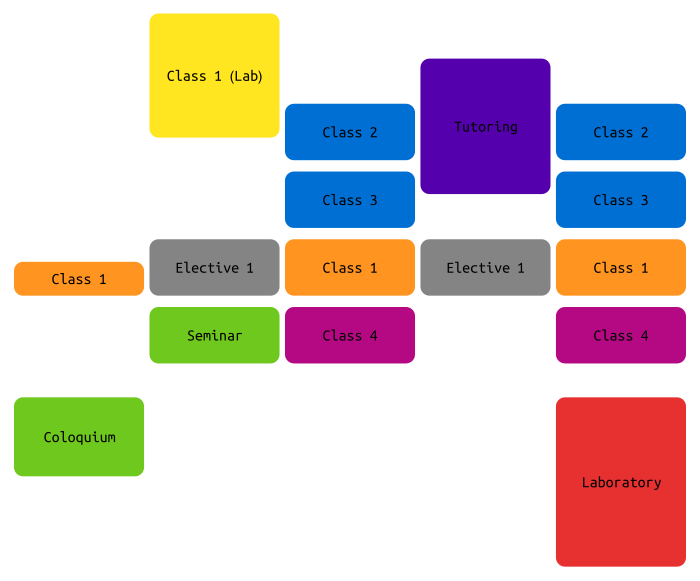

# wolfram-schedule-tab

Tool for generate a tooltip-ed SVG-HTML weekly lecture schedule from the Wolfram language.

******************

# The idea:

You write a table like this with your lecture schedule:

|	Day			|	Name			|	Start	|	End		|	Color	|	Room	|
|---------------|-------------------|-----------|-----------|-----------|-----------|
|	Monday		|	Class 1			|	13:30	|	14:15	|	Yellow	|	Teams	|
|	Monday		|	Class 3			|	15:30	|	17:15	|	Green	|	Z-101	|
|	Tuesday		|	Class 1 (Lab)	|	08:00	|	10:45	|	Orange	|	A-401	|
|	Wednesday	|	Class 2			|	10:00	|	11:15	|	Blue	|	Zoom	|
|	Thursday	|	Tutoring		|	09:00	|	12:00	|	Purple	|	Meet	|
|	Friday		|	Class 2			|	10:00	|	11:15	|	Blue	|	Zoom	|
|	Friday		|	Class 4			|	14:30	|	15:45	|	Magenta	|	Webex	|

in `CSV` format. Say, `2020-2-schedule.csv`. 

To generate, run `wolframscript -file generate.wl 2020-2-schedule.csv` on the terminal.
Obviously, this will require `wolframscript` to be installed on your system. The schedule will be in a `results` folder. Just open the HTML on your browser.

An example `CSV` file is in the test folder. Also, there is a demonstration on the dark and light color schemes. You can change it in the `generate.wl` file by commenting one or another.

